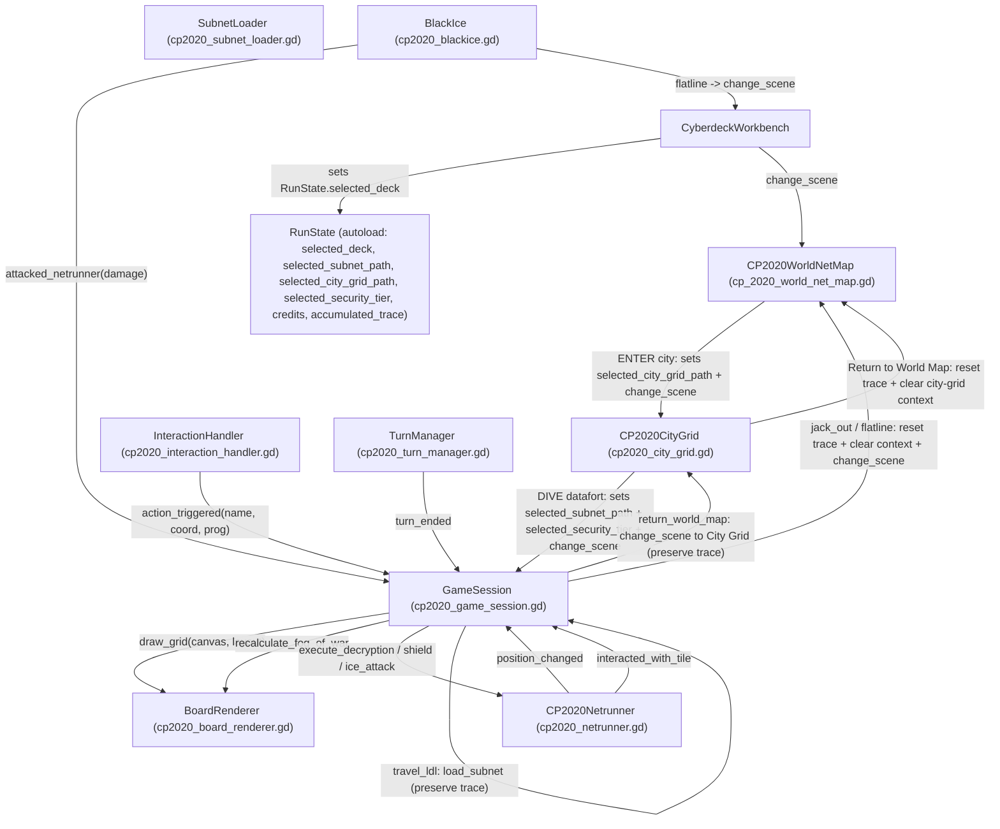

# Netrunner V0.006 - Architecture & System Reference

This document provides a comprehensive breakdown of the system architecture, code organization, data models, signal flows, and mechanics for the Cyberpunk 2020 (CP2020) Netrunning game built in **Godot 4**. It is designed as a direct technical primer for coding agents and human developers.

---

## 1. Executive Overview & Tech Stack

- **Engine Version**: Godot 4.7 (Forward Plus rendering, 2D canvas nodes)
- **Language**: GDScript (using strictly typed variables, custom resources, enums, signals)
- **Theme/Genre**: Cyberpunk 2020 Netrunning simulation (grid-based datafort intrusion, fog-of-war matrix exploration, turn-based Black ICE pathfinding, program memory unit management)

---

## 2. Directory Structure

```
netrunner-v-0.006/
├── project.godot                     # Godot project configuration & input maps
├── data/                             # Resource instances (.tres) for decks, programs & maps
│   ├── starting_deck.tres            # Cyberdeck resource instance
│   ├── codecracker.tres              # Program resources (.tres)
│   ├── killer2.tres
│   ├── watchdog.tres                 # Watchdog — Detection/Alarm program (STR 4, 610eb, 5 MU)
│   ├── world_map_default.tres        # Default CP2020WorldMapLayout (regions + hubs, hub.city_grid_path)
│   ├── city_grids/                   # CP2020CityGridLayout per city (12 files)
│   │   ├── night_city.tres
│   │   ├── london.tres
│   │   └── ...
│   └── ...
├── scenes/                           # Godot scene files (.tscn)
│   ├── cp2020_gameplay.tscn          # Main gameplay (datafort) scene
│   ├── forts/                        # Saved datafort maps (.tres resources)
│   │   ├── night_city_subnet.tres
│   │   ├── london_subnet.tres
│   │   ├── tokyo_subnet.tres
│   │   └── fort1/2/3.tres
│   └── ui/                           # Subscenes (Netrunner avatar, Black ICE, Designers, Workbench, Maps)
│       ├── cp2020_blackice.tscn
│       ├── cp2020_netrunner.tscn
│       ├── cp2020_world_net_map.tscn       # World Map scene (geographic; ENTER city → City Grid)
│       ├── cp2020_world_map_designer.tscn  # World map authoring tool
│       ├── cp2020_city_grid.tscn           # City Grid scene (per-city datafort icons)
│       ├── cp2020_city_grid_designer.tscn  # City Grid authoring tool
│       ├── CP2020DesignerCanvas.tscn       # Datafort authoring tool
│       └── CyberdeckWorkbench.tscn         # Deck/program loadout UI
└── scripts/
    ├── autoload/
    │   └── run_state.gd              # RunState singleton — cross-scene run state
    ├── resources/                    # Core gameplay resources, nodes & controllers
    │   ├── CP2020DatafortLayout.gd   # Datafort grid layout Resource definition
    │   ├── CP2020TileData.gd         # Individual grid tile state Resource (incl. LDL fields)
    │   ├── CP2020WorldMapLayout.gd   # World map layout (regions + hubs) Resource
    │   ├── CP2020WorldHub.gd         # City hub Resource (name, pos, city_grid_path; tier kept for compat)
    │   ├── CP2020WorldRegion.gd      # World region Resource (name + colour, categorising only)
    │   ├── cp2020_security_tier.gd   # CP2020SecurityTier const class (Tier enum + LABELS/COLORS/GLYPHS)
    │   ├── cp2020_city_grid_datafort.gd # CP2020CityGridDatafort resource (datafort icon on a city grid)
    │   ├── cp2020_city_grid_layout.gd  # CP2020CityGridLayout resource (city grid layout)
    │   ├── cp2020_city_grid.gd       # City Grid runtime node (movement, dive, return to world map)
    │   ├── cp2020_city_grid_designer.gd # @tool City Grid authoring tool
    │   ├── cp_2020_world_net_map.gd  # Runtime world map node (movement, LDL jumps, ENTER city grid)
    │   ├── cp2020_blackice.gd        # Black ICE enemy AI node (AStarGrid2D, tracing)
    │   ├── cp2020_board_renderer.gd  # CanvasItem custom grid renderer (Fog of War)
    │   ├── cp2020_canvas.gd          # UI container grid loader (legacy/placeholder)
    │   ├── cp2020_cyberdecks.gd      # Cyberdeck data Resource class
    │   ├── cp2020_datafort_designer.gd # @tool editor for building maps + LDL-link editor
    │   ├── cp2020_game_session.gd    # Datafort session manager / orchestrator
    │   ├── cp2020_interaction_handler.gd # Contextual right-click PopupMenu handler
    │   ├── cp2020_netrunner.gd       # Player Netrunner entity controller
    │   ├── cp2020_programs.gd        # Software program Resource class
    │   ├── cp2020_subnet_loader.gd   # ResourceLoader for datafort layout files
    │   ├── cp2020_turn_manager.gd    # Turn state controller
    │   └── cp2020_world_map_designer.gd # @tool world map authoring tool
    └── ui/
        └── cyberdeck_workbench.gd    # Cyberdeck loadout & program management UI script
```

---

## 3. Core Architecture & Component Diagram

The gameplay loop is built around a decoupled component architecture. Cross-scene state lives in the `RunState` autoload singleton. The player flows through **three map levels** matching the CP2020 sourcebook: **Workbench** → **World Map** → **City Grid** → **Datafort (gameplay)**, with LDL links enabling travel between dataforts and back up the stack.



### Scene Flow (3-Level Map Model)

1. **CyberdeckWorkbench** — pick a deck and load programs, then `Jack In`.
2. **World Map** (`cp2020_world_net_map.tscn`) — geographic grid of regions + city markers. Move between cities; hack/pay LDL to build trace. Right-click a city → **ENTER City Grid** (loads that city's `CP2020CityGridLayout` via `hub.city_grid_path`).
3. **City Grid** (`cp2020_city_grid.tscn`) — per-city grid of datafort icons (security-tier coded). Runner enters at the LDL entry tile, moves 5/turn. **Stepping onto a datafort icon auto-dives** into its subnet (no Hack/Pay LDL here — that's world-map only). Right-click the runner's tile to **Return to World Map** (resets trace).
4. **Gameplay / Datafort** (`cp2020_gameplay.tscn`) — explore the datafort with fog of war, fight ICE, use programs. LDL-link tiles travel to other dataforts (preserve trace) or **Return to City Grid** (preserve trace — still in the run). Jack-out / flatline returns to the World Map and resets trace (full abort).

---

## 4. Data Models (Custom Resources)

All data objects inherit from `Resource` to allow direct serialization to `.tres` files and inspector editing.

### 4.1 `CP2020DatafortLayout` ([CP2020DatafortLayout.gd](file:///c:/Users/mecca/Documents/netrunner-v-0.006/scripts/resources/CP2020DatafortLayout.gd))
Represents a grid map layout for a Datafort.
- **Properties**:
  - `fort_name: String`
  - `rows: int` (default 15)
  - `columns: int` (default 15)
  - `cpu: int`, `int_rating: int`, `datawall_strength: int`
  - `grid_tiles: Dictionary` - Maps `Vector2i(x, y)` to [CP2020TileData](file:///c:/Users/mecca/Documents/netrunner-v-0.006/scripts/resources/CP2020TileData.gd)
- **TileType Enum**:
  - `EMPTY` (0), `WALL` (1), `DATAWALL` (2), `ENTRY` (3), `CODE_GATE` (4), `MEMORY_UNIT` (5), `CONTROL_NODE` (6), `BLACK_ICE` (7)

### 4.2 `CP2020TileData` ([CP2020TileData.gd](file:///c:/Users/mecca/Documents/netrunner-v-0.006/scripts/resources/CP2020TileData.gd))
Represents state and attributes of a single cell in the datafort layout grid.
- **Properties**:
  - `tile_type: CP2020DatafortLayout.TileType`
  - `tile_name: String`
  - `strength_str: int` (Used as hit points / Difficulty Value for Code Gates and Datawalls)
  - `memory_units_mu: int`
  - `reward_credits: int`
  - `is_unlocked: bool` (Breach / Decrypted state for Code Gates)
  - `ldl_links: Dictionary` (legacy, unused — kept for save compat)
  - `is_visible: bool` (Dynamic Line of Sight visibility)
  - `is_explored: bool` (Visited or previously seen tile state for Fog of War)
  - **LDL Routing** (authored in the datafort designer's LDL-link editor):
    - `is_ldl_link: bool` — marks the tile as a Long Distance Line connection point
    - `target_subnet_path: String` — `.tres` resource path to the linked remote datafort (empty = world-map-return-only)
    - `target_entry_coord: Vector2i` — arrival coordinate in the remote subnet (`(-1,-1)` = unset; falls back to first ENTRY)
  - **Per-tile ICE overrides** (BLACK_ICE tiles; authored in the datafort designer's ICE editor; zero/empty = use the hub security-tier template):
    - `ice_program: NetProgram` — optional assigned `program.tres` supplying the ICE's `program_name` / `strength` / `effect_type` / `damage_dice` (drives behavior: `DAMAGE_RUNNER` = health attack; `DEREZ_ICE` = anti-program attack on installed programs); `duplicate()`d at spawn
    - No per-tile scalar stat overrides — `max_integrity` is derived 1:1 from `program.strength`, movement is a flat `BlackIce.ICE_MOVEMENT_PER_TURN` (5) for all ICE, and tracing is deferred to program-specific logic (no scalar `traces` flag). The old `ice_*` scalar fields and `ice_has_override` have been removed.

### 4.3 `CP2020WorldMapLayout` ([CP2020WorldMapLayout.gd](file:///c:/Users/mecca/Documents/netrunner-v-0.006/scripts/resources/cp2020WorldMapLayout.gd))
Serializable world map authored by the world map designer and loaded at runtime by `cp_2020_world_net_map.gd`.
- **Properties**:
  - `grid_cols: int`, `grid_rows: int` (default 32×18)
  - `regions: Array[CP2020WorldRegion]` — colour + label only (categorising; never block movement)
  - `tile_region: Dictionary` — `Vector2i`/`"x,y"` → region index; absent keys = open ocean
  - `hubs: Array[CP2020WorldHub]` — city hubs overlaying their region tile
  - `runner_spawn_hub: String` (default "Night City")
- **Helpers**: `get_region(pos)`, `get_hub(pos)`, `get_hub_by_name(name)`

### 4.4 `CP2020WorldHub` ([CP2020WorldHub.gd](file:///c:/Users/mecca/Documents/netrunner-v-0.006/scripts/resources/cp2020_world_hub.gd))
- `name: String`, `pos: Vector2i`, `subnet_path: String` (legacy fallback datafort `.tres`; the City Grid is now the entry point), `ldl_cost: int`, `security_code: int` (1D10 target to hack the LDL), `trace_value: int` (trace added on a successful jump through this hub's LDL)
- `city_grid_path: String` — path to the city's `CP2020CityGridLayout` `.tres`. The world map ENTER action loads this. **This is the primary link from the world map into a city.**
- `security_tier: int` — CP2020 classification (CP2020SecurityTier.Tier: `GREY=0`, `LEVEL_1=1`, `LEVEL_2=2`, `LEVEL_3=3`, `BLACK=4`). **Kept for save compatibility only** — tier no longer drives world-map icons (cities are plain markers) and no longer drives datafort ICE; the per-datafort tier on the City Grid is now the source of truth for ICE loadouts. Tier metadata consts live in `CP2020SecurityTier` (see 4.8).
- `security_code` (LDL hack difficulty) and `security_tier` (classification) are kept separate per the sourcebook.

### 4.5 `CP2020WorldRegion` ([CP2020WorldRegion.gd](file:///c:/Users/mecca/Documents/netrunner-v-0.006/scripts/resources/cp2020_world_region.gd))
- `name: String`, `color: Color` — purely visual categorisation; ocean is the absence of a region assignment.

### 4.6 `CP2020SecurityTier` ([cp2020_security_tier.gd](file:///c:/Users/mecca/Documents/netrunner-v-0.006/scripts/resources/cp2020_security_tier.gd)) — *NEW*
Shared const class (single source of truth for tier rendering). Referenced as `CP2020SecurityTier.Tier.GREY`, `CP2020SecurityTier.COLORS[tier]`, etc.
- `enum Tier { GREY, LEVEL_1, LEVEL_2, LEVEL_3, BLACK }`
- `LABELS: Dictionary` — full labels (`"Grey"`, `"Level 1"`, ..., `"Black"`)
- `SHORT: Dictionary` — short tags (`"G"`, `"L1"`, `"L2"`, `"L3"`, `"B"`)
- `COLORS: Dictionary` — tier colours (Grey=grey, L1=green, L2=yellow, L3=orange, Black=red)
- `GLYPHS: Dictionary` — single-char icon glyphs (`"G"`, `"1"`, `"2"`, `"3"`, `"B"`)

### 4.7 `CP2020CityGridDatafort` ([cp2020_city_grid_datafort.gd](file:///c:/Users/mecca/Documents/netrunner-v-0.006/scripts/resources/cp2020_city_grid_datafort.gd)) — *NEW*
A datafort icon on a City Grid. Tier classifies the datafort (per sourcebook), and the runtime reads `security_tier` at dive time to set `RunState.selected_security_tier`.
- `name: String`, `pos: Vector2i` (grid tile)
- `subnet_path: String` — the datafort interior `.tres` (e.g. `night_city_subnet.tres`)
- `security_tier: int` (CP2020SecurityTier.Tier) — drives the icon colour/glyph AND the datafort's default ICE loadout
- `ldl_cost: int` (default 50), `security_code: int` (default 4, 1D10 hack target), `trace_value: int` (default 5)

### 4.8 `CP2020CityGridLayout` ([cp2020_city_grid_layout.gd](file:///c:/Users/mecca/Documents/netrunner-v-0.006/scripts/resources/cp2020_city_grid_layout.gd)) — *NEW*
Serializable per-city grid authored by the City Grid designer and loaded at runtime by `cp2020_city_grid.gd`.
- `city_name: String`, `grid_cols: int` (default 20), `grid_rows: int` (default 12)
- `dataforts: Array[CP2020CityGridDatafort]` — the datafort icons on the grid
- `ldl_entry: Vector2i` — the runner arrival tile from the world map
- **Helpers**: `get_datafort(pos)`, `get_datafort_by_name(name)`

### 4.9 `Cyberdeck` ([cp2020_cyberdecks.gd](file:///c:/Users/mecca/Documents/netrunner-v-0.006/scripts/resources/cp2020_cyberdecks.gd))
Represents the Netrunner's hardware deck.
- **Properties**:
  - `deck_name: String`
  - `max_mu: int` (Maximum Memory Units storage capacity)
  - `speed_bonus: int`
  - `data_wall_strength: int`
  - `interface_rank: int` (default 6) — the Netrunner's Interface skill when using this deck; read by the world map and shown in the workbench.
  - `installed_programs: Array[NetProgram]`
- **Methods**: `get_used_mu() -> int`

### 4.10 `NetProgram` ([cp2020_programs.gd](file:///c:/Users/mecca/Documents/netrunner-v-0.006/scripts/resources/cp2020_programs.gd))
Represents an executable program software tool loaded into a cyberdeck.
- **ProgramType Enum**: `DECRYPTION`, `DETECTION`, `ANTI_PROGRAM`, `ANTI_PERSONNEL`, `ANTI_SYSTEM`, `UTILITY`, `ICE`
- **EffectType Enum**:
  - `BYPASS_GATE`: Cracks Code Gates (sets `is_unlocked = true`)
  - `BREACH_WALL`: Breaches Datawalls
  - `DEREZ_ICE`: Destroys hostile Black ICE
  - `DAMAGE_RUNNER`: Black ICE direct attacks
  - `REVEAL_NODES`: Scans hidden layout nodes
  - `MODIFY_MU`: Modifies deck speed or memory capacity
  - `SHIELD`: Defense program (raised on the runner's own tile) — one-shot opposed-roll blocker
  - `CRASH_CPU`: Anti-system program (Krash) — crashes a datafort CPU for 1D6+1 turns; also crashes the runner's cyberdeck when used by datafort resident programs
  - `ARMOR`: Defense program (raised on the runner's own tile) — persistent point-for-point damage absorber (absorbs `min(damage, armor.strength)` before Shield roll; NOT consumed on hit)
  - `WORM`: Stealth opener — slips behind a DATAWALL or locked CODE_GATE and opens it from the inside over 2 turns. No alert (no trace increase, no ICE activation)
  - `DETECTION`: Detection/Alarm program (Watchdog). Dual-role: as **ICE** (a `BlackIce` with `effect_type = DETECTION`), it scans a 20-space LoS radius each turn and trips the datafort alarm on first sighting the runner (emits `alarm_triggered`); as a **netrunner-deployed program**, it drops a stationary beacon at the runner's position that watches for enemies entering its 20-space LoS each turn. STR 4, 610 eb, 5 MU
- **Properties**: `program_name`, `type`, `effect_type`, `memory_cost` (MU), `strength`, `price`, `icon`, `description` (one-line summary shown in the workbench detail card), `damage_dice` (optional: `0` = flat `strength` per Black ICE hit, default for all existing programs; `>0` = roll `1D{damage_dice}` per hit, e.g. **Sword** = 6). Backward-compatible.

---

## 5. Core Systems & Implementation Details

### 5.1 Game Session Orchestrator ([cp2020_game_session.gd](file:///c:/Users/mecca/Documents/netrunner-v-0.006/scripts/resources/cp2020_game_session.gd))
Controls gameplay flow, scene initialization, input routing, turn changes, terminal logs, and program interactions.
- **Constants & Grid Math**:
  - `cell_size = 40` px
  - `grid_offset_y = 90` px (Reserving top UI header space)
  - Coordinates match formula: `Vector2(coord.x * 40 + 20, 90 + coord.y * 40 + 20)`
- **`_ready`**: connects interaction/turn/netrunner signals, applies `RunState.selected_deck` to the netrunner (deck name, MU capacity, duplicate of installed programs), loads the subnet from `RunState.selected_subnet_path` (or `starting_subnet_path` fallback), and refreshes deck/health/trace HUD.
- **`load_subnet(path, entry_coord)`**: Loads a `CP2020DatafortLayout` via `ResourceLoader`, assigns it to the renderer, **resets `is_explored`/`is_visible` on every tile** (ResourceLoader returns a cached instance, so a previously-visited datafort would otherwise show as already-revealed after LDL travel), spawns the netrunner at `entry_coord`, spawns ICE, and recalculates fog. A fresh run always starts fully fogged. Also clears `_watchdog_beacons` / `_watchdog_alerted` / `_deployed_programs` (deployed Watchdog beacons do not persist across dataforts).
- **LDL Travel** (`_on_action_triggered`):
  - `"travel_ldl"` — the program arg is the `CP2020TileData` of the LDL link; loads its `target_subnet_path` at `target_entry_coord`. Aborts with a terminal message if no target is set. Trace is preserved across the jump.
  - `"return_world_map"` — changes scene to the **City Grid** (`cp2020_city_grid.tscn`) via `RunState.selected_city_grid_path` (world-map fallback if no city grid recorded) and **preserves trace** (still in the run). Labelled "Returning to the City Grid via LDL."
- **Jack-out** (`_on_jack_out_pressed`) / **Flatline** (`_on_flatlined`): clears `accumulated_trace` + `selected_city_grid_path` + `selected_security_tier` (full abort) and changes scene to the world map.
- **Flatline**: on `netrunner.flatlined`, clears trace and returns to the workbench scene (`CyberdeckWorkbench.tscn`).
- **Camera Follow**: a `Camera2D` ("RunnerCamera") is parented under the board renderer; `_update_camera_limits` clamps it to the datafort rect and `_center_camera_on_runner` snaps it to the netrunner. `netrunner.position_changed` re-centres the camera.
- **Trace HUD**: `_update_trace()` writes `RunState.accumulated_trace` to the `TraceLabel`.
- **Line of Sight / Fog of War**:
  - The shared line-of-sight helper is `CP2020DatafortLayout.line_of_sight(from, to, max_range)` — a Euclidean distance check combined with the Bresenham raycast that blocks on `DATAWALL` tiles and locked `CODE_GATE` tiles (`is_unlocked == false`). The target tile itself is never a blocker.
  - `max_range` is **required** (no shared default): the runner and each program keep **separate** per-entity `@export var sight_range` values — `CP2020Netrunner` and `BlackIce` default to **20** (CP2020 PnP max sight), `CP2020NpcNetrunner` and `CP2020Datafort` default to 10.
  - Fog of war (`recalculate_fog_of_war`) uses `netrunner.sight_range` and the shared helper; sets `tile.is_visible = true` and `tile.is_explored = true`. `cp2020_game_session._has_line_of_sight` is now a thin wrapper over the helper.
  - **Sight-gated adversaries**: Black ICE, hostile NPC netrunners, and the datafort's resident programs only act when they have line of sight to the netrunner within their own `sight_range`. Without LoS they go **dormant** (hold position, no activation/attack this turn). NEUTRAL NPCs keep wandering regardless of LoS; CPU reboot timers continue regardless of sight. Last-known-position hunting is intentionally **not** implemented (future stealth/triggers pass).
- **Decryption Mechanics**:
  - Initiated when player selects a decryption program (`BYPASS_GATE`) via right-click contextual menu on a Code Gate.
  - Roll: `(randi() % 10) + 1 + program.strength` (Cyberpunk 2020 1d10 + Program STR rule).
  - Check: If `total_roll >= tile.strength_str`, `tile.is_unlocked = true`, immediately clearing the movement obstacle, changing tile color from orange to green, and recalculating Line of Sight. Otherwise, the attempt fails and logs the roll details to the terminal.
- **Worm Mechanics** (`execute_worm` / `_tick_worm_programs`):
  - `execute_worm(program, target_coord)` — called from `_on_action_triggered` when a `WORM`-effect program is used on a `DATAWALL` or locked `CODE_GATE`. Sets `tile.worm_turns_remaining = 2`, logs, redraws. Tile is **not** opened immediately. **No trace increase, no ICE activation** (stealth opener).
  - `_tick_worm_programs()` — called at the start of each netrunner turn (by `_on_turn_ended`). Iterates all grid tiles, decrements `worm_turns_remaining`; at 0, opens the tile (DATAWALL → EMPTY, CODE_GATE → `is_unlocked = true`), logs, recalculates fog of war, redraws.
- **Watchdog Alarm & Beacons** (Detection/Alarm system — dual-role `DETECTION` effect):
  - **ICE-side alarm** (`_on_ice_alarm_triggered()`): connected to each `BlackIce.alarm_triggered` signal at spawn. When a DETECTION ICE (Watchdog) first sights the runner within its 20-space LoS, it emits `alarm_triggered`; the handler iterates all `ice_nodes` and calls `activate_alarm()` on every non-DETECTION ICE, waking dormant ICE to `PURSUE` (`_activated = true`, `current_state = PURSUE`). The Watchdog itself stays stationary — no pursuit, no attack, no trace. Initiative is handled naturally by the turn manager (the runner can kill it or retreat before it acts).
  - **Netrunner-side tripwire** (`execute_detection()` / `_tick_watchdog_beacons()`): the `DETECTION` case in `_on_action_triggered` calls `execute_detection(program)`, which spends 1 action to deploy a Watchdog beacon at the runner's current grid coord. Beacons are stored in `_watchdog_beacons: Array[Vector2i]`; `_watchdog_alerted: Dictionary` (keyed by coord) tracks whether a beacon has already logged its first detection. Each netrunner turn, `_tick_watchdog_beacons()` scans a 20-space LoS from every beacon for enemy ICE/NPCs and logs a `"WATCHDOG ALERT"` message the first time an enemy enters range (per beacon). Beacons are passive — they do not attack, move, or consume further actions.
  - **One File, One Instance**: deployed programs are appended to `_deployed_programs: Array[NetProgram]` on the game session. In `_input`, the available-programs list passed to the interaction handler is filtered to exclude any program in `_deployed_programs`, so a deployed Watchdog cannot be re-deployed. To run two beacons, load two copies of the Watchdog program at the workbench (each `.tres` is a separate program instance). Beacons + `_deployed_programs` + `_watchdog_alerted` are cleared in `load_subnet` (same cached-instance reset pattern as fog/worm/CPU crash).

### 5.2 Board Renderer ([cp2020_board_renderer.gd](file:///c:/Users/mecca/Documents/netrunner-v-0.006/scripts/resources/cp2020_board_renderer.gd))
Performs procedural drawing via `CanvasItem.draw_*` calls based on the 3 tile visibility states:
1. **Unexplored (`is_explored == false`)**: Solid black background (`Color.BLACK`).
2. **Explored / Fog of War (`is_explored == true`, `is_visible == false`)**: Darkened floor tile (`Color(0.04, 0.04, 0.05)`), faint grid outlines (`alpha = 0.3`), dimmed tile graphics.
3. **Visible (`is_visible == true`)**: Bright floor tile (`Color(0.08, 0.08, 0.08)`), vibrant grid borders (`Color(0.3, 0.4, 0.5)`), full opacity tile graphics:
   - `ENTRY`: Green/Cyan outlined box with directional polygon glyph
   - `DATAWALL`: Solid red barrier box
   - `CODE_GATE`: Orange barrier (locked) or Green barrier (unlocked) with dividing horizontal beam
   - **Worm-in-progress indicator**: DATAWALL and CODE_GATE tiles with `worm_turns_remaining > 0` render a pulsing purple circle with a "W" glyph (three diagonal strokes), signalling an active stealth open.
   - **Watchdog beacon overlay**: tiles in the renderer's `watchdog_beacons: Array[Vector2i]` array (synced from the game session) render a pulsing amber circle with a "W" glyph — visually distinct from the Worm's purple "W" (different colour + stroke style). Drawn in `draw_grid()` over the beacon tiles so deployed tripwires are visible at a glance.

### 5.3 Player Netrunner Controller ([cp2020_netrunner.gd](file:///c:/Users/mecca/Documents/netrunner-v-0.006/scripts/resources/cp2020_netrunner.gd))
- Handles keyboard movement (`WASD` or Arrow keys via `ui_up`, `ui_down`, `ui_left`, `ui_right`).
- Checks boundaries against layout bounds (`0..columns-1`, `0..rows-1`).
- Validates movement obstacles: blocks movement into `DATAWALL` tiles or locked `CODE_GATE` tiles. Empty cells (no tile) are walkable.
- `initialize(layout, entry_coord)`: spawns at `entry_coord` if supplied, in-bounds, and a tile exists there (used by mid-run LDL travel); otherwise falls back to the first `ENTRY` tile.
- **Program-HP model** (`program_integrity` Dictionary): a program's `strength` is also its max health. Anti-program (`DEREZ_ICE`) ICE attacks call `damage_program(amount, attacker)` which damages a random installed program and uninstalls (destroys) it at 0 integrity; the raised shield does **not** block anti-program attacks.
- **Combat model** (CP2020 PnP): Initiative = `1D10 + REF + Cyberdeck Speed` (runner) vs `1D10 + System INT` (CPUs×3); ties are simultaneous. Movement is 5 spaces/turn, separate from the 1 action/turn. Sight range is 20. Combat roll ties → attacker. **Armor** absorbs point-for-point first (persistent), then **Shield** opposed roll (ties→attacker, one-shot), then HP. **Anti-personnel hits** (`apply_damage(..., is_anti_personnel=true)`) also cause INT-stat loss (1/hit) and a Mortal/Stun save (`1D10+body` vs cumulative-damage target). **Deck crash** (`crash_deck`) from `CRASH_CPU` resident programs forces actions=0 for `1D6+1` turns (movement preserved). Stats: `reflex` (initiative), `intelligence`/`body` (meat-space), `interface_rank` (legacy).
- Emits `position_changed`, `message_logged`, `deck_updated`, `shield_raised`, `shield_consumed`, `armor_raised`, `armor_consumed`, `health_changed`, `int_changed`, `stunned`, `deck_crashed`, and `flatlined` (when `current_health <= 0`).

### 5.4 Hostile Black ICE AI ([cp2020_blackice.gd](file:///c:/Users/mecca/Documents/netrunner-v-0.006/scripts/resources/cp2020_blackice.gd))
- **Pathfinding**: Instantiates an `AStarGrid2D` instance over the layout matrix region.
- Dynamic obstacle update ([_update_obstacles](file:///c:/Users/mecca/Documents/netrunner-v-0.006/scripts/resources/cp2020_blackice.gd#L99)): dynamic solid points applied to `DATAWALL` tiles and locked `CODE_GATE` tiles.
- **States**: `IDLE` -> `PURSUE`. Activates upon turn execution, taking up to `ICE_MOVEMENT_PER_TURN` (5) steps per turn toward the Netrunner's position (mirrors the netrunner's 5-movement-point economy). On reaching the runner, branches on `effect_type`: `DAMAGE_RUNNER` emits `attacked_netrunner(damage)` (anti-personnel health attack); `DEREZ_ICE` emits `attacked_program(damage)` (anti-program attack on installed programs — see §5.3 program-HP model). The attack is a single action delivered when the ICE reaches the runner's tile and does not consume movement. `damage` is computed by `_roll_damage()`: `strength` when `damage_dice <= 0` (flat-strength, legacy default), otherwise `randi_range(1, damage_dice)` — a per-hit dice roll sourced from the assigned program (e.g. **Sword** rolls 1D6 per hit). The program, not a global rule, defines how damage is dealt.
- **DETECTION ICE (Watchdog alarm)**: a `BlackIce` with `effect_type = DETECTION` (value `10`) is a stationary alarm tripwire — it **does not pursue, attack, or trace**. In `take_turn`, the DETECTION case scans a 20-space LoS radius (`sight_range`) for the netrunner; on the first sighting it emits `alarm_triggered` (once per ICE) and logs the alert. The game session's `_on_ice_alarm_triggered()` then calls `activate_alarm()` on every other non-DETECTION ICE node, waking dormant ICE (`_activated = true`, `current_state = PURSUE`). Initiative is handled naturally by the turn manager — the runner can kill the Watchdog or retreat before it acts. See §5.1 for the alarm handler + netrunner-side beacon system.
- **`activate_alarm()`**: new method that wakes a dormant ICE node — sets `_activated = true` and `current_state = PURSUE`. Called by the game session on all non-DETECTION ICE when a DETECTION ICE trips the alarm. Has no effect on an already-active node.
- **New signal**: `alarm_triggered` — emitted by a DETECTION ICE on its first sighting of the netrunner. Connected to `game_session._on_ice_alarm_triggered()`.
- **Tracing ICE**: tracing behavior (formerly a per-tile `traces` scalar that rolled `1D10 + strength` vs `RunState.accumulated_trace` on first activation) has been **removed as a scalar** and is deferred to program-specific logic for Watchdog-type programs. No ICE traces in the current build; the activation-trace block was removed from `NetProgram.take_ice_turn`.
- **Fog of War Visibility**: Dynamically updates the `skull_label` icon visibility based on the tile fog state.
- **Stat sourcing** (see `cp2020_game_session.spawn_black_ice`): ICE stats are set on the node **before** `initialize()` (which copies `max_integrity` into `current_integrity`). Sourcing precedence: (1) `tile.ice_program` (assigned `program.tres`) supplies name/strength/`effect_type`/`damage_dice` (program is `duplicate()`d); (2) otherwise the hub's `security_tier` selects a default template from `TIER_ICE_TEMPLATES` (Grey→Watchdog, L1→Killer 1.0, L2→Killer 2.0, L3→Hellhound, Black→Flatline), built into a base `NetProgram`. `max_integrity` is always derived 1:1 from `program.strength`. Movement is a flat `BlackIce.ICE_MOVEMENT_PER_TURN` (5) for all ICE. There are no per-tile scalar stat overrides — the old `ice_*` scalar fields and `ice_has_override` override path have been removed.

### 5.5 Contextual Right-Click Input Handler ([cp2020_interaction_handler.gd](file:///c:/Users/mecca/Documents/netrunner-v-0.006/scripts/resources/cp2020_interaction_handler.gd))
- Captures right-click mouse events over grid cells.
- Converts mouse pixel coordinates to grid cell coordinates `Vector2i(grid_x, grid_y)`.
- Checks if tile `is_explored` (menus are blocked on unexplored tiles). **Must use `layout.get_tile(coord)`** — `.tres` files store dictionary keys as `"x,y"` strings, so a direct `grid_tiles.get(Vector2i)` always returns null.
- **Menu branches** (first match wins):
  - **LDL-link tiles** (`is_ldl_link`): always add "Travel to \<datafort\>" (id `3000`) + "Return to City Grid" (id `3001`), even with no matching program. Travel uses `_ldl_tile` (the stored tile data); empty target → the session aborts the travel with "no target subnet set", so an empty-target LDL link effectively offers city-grid-return only.
  - **Visible Black ICE on the tile**: offer `DEREZ_ICE` programs (ids `1000+i`).
  - **Runner's own tile** (visible): offer `SHIELD` (ids `1000+i`) and `ARMOR` (ids `7000+i`) defense programs, plus `DETECTION` programs (ids `1000+i`) labelled `"Watchdog (Deploy STR X, X MU)"`. Armor is a persistent passive absorber; raising it does not consume a turn action. A `DETECTION` program consumes 1 action to deploy a Watchdog beacon at the runner's current position (see §5.1 Watchdog Alarm & Beacons). A program already deployed this run is filtered out of the offered list (one file, one instance — load a second copy at the workbench to run two beacons).
  - **Locked Code Gate**: offer `BYPASS_GATE` programs and `WORM`-effect programs (stealth opener, 2-turn open, no alert). Menu label: `"Worm (Stealth, 2 turns, X MU)"`.
  - **Datawall**: offer `BREACH_WALL` programs and `WORM`-effect programs (stealth opener, 2-turn open, no alert). Menu label: `"Worm (Stealth, 2 turns, X MU)"`.
- `_on_menu_action_selected` checks ids in order: LDL travel (`3000`/`3001`) → NPC talk (`4000`) → NPC attack (`2000+i`) → CPU crash (`5000+i`) → memory files (`6000+i`/`6999`) → Armor-raise (`7000+i`) → loot (`loot_tile`) → program use (`1000+i`). **Do not reorder.**
- Dynamically creates and opens a `PopupMenu` near mouse location (`popup_on_parent`).

### 5.6 Datafort Designer Tool ([cp2020_datafort_designer.gd](file:///c:/Users/mecca/Documents/netrunner-v-0.006/scripts/resources/cp2020_datafort_designer.gd))
- Runs in editor (`@tool` annotation).
- Visual editor interface for painting tiles. The toolbar has distinct **Entry** (plain datafort arrival point, `is_ldl_link=false`) and **LDL Link** (travel node, `is_ldl_link=true` with no hardcoded target) buttons, plus Datawall, Code Gate, Memory Unit, Control Node, Black ICE, and Eraser.
- **LDL-Link Editor panel** (built in code as a `PanelContainer`+`VBox` anchored to the right edge so it stays on-screen): target subnet `LineEdit` + Browse `FileDialog` (scoped to `scenes/forts/*.tres`), target entry coord X/Y `SpinBox`es, and a "Clear target" button. In LDL mode, clicking an existing LDL link selects it for editing (does not overwrite); clicking empty space paints a new link and opens the editor. Field edits write back to the tile live and persist on save. Empty target = world-map-return-only. LDL links draw with a distinct blue frame + "L" glyph.
- **ICE Editor panel** (built in code; shown when a BLACK_ICE tile is painted/selected): a "Program .tres..." browse button + "Clear assigned program" button (assigns an optional `NetProgram` `.tres` whose `program_name`/`strength`/`effect_type`/`damage_dice` derive the ICE's name/strength/behavior/damage — the effect_type is shown as readable text), and a "Reset to template" button. Leave the program unset to use the hub's tier template; assign a program to override the template for that tile. `max_integrity` is derived 1:1 from the program's `strength`, movement is a flat 5 for all ICE, and tracing is deferred to program-specific logic — so there are no per-tile scalar stat fields. Edits write back to the tile's `ice_program` field live and persist on save.
- Dynamic layout resizing (`SpinBox` input for columns/rows).
- Native file open/save dialog integration (`FileDialog`) for loading and exporting `.tres` layout files.

### 5.7 World Map Designer Tool ([cp2020_world_map_designer.gd](file:///c:/Users/mecca/Documents/netrunner-v-0.006/scripts/resources/cp2020_world_map_designer.gd))
- `@tool` editor that authors a `CP2020WorldMapLayout` `.tres` (regions + hubs) consumed at runtime by `cp_2020_world_net_map.gd`.
- Tools: `REGION` (paint region colour), `HUB` (place/select a hub), `ERASER`.
- Side panel edits the selected hub: name, subnet path (+ Browse), **City Grid path** (+ Browse `data/city_grids/*.tres`, writes `hub.city_grid_path`), LDL cost, security code, trace value, set-as-spawn, delete. The Security Tier `OptionButton` is **hidden** (tier moved to City Grid dataforts; field kept on the resource for save compat). Hub chips are drawn as plain cyan markers (no tier glyph). Region list with add/paint.

### 5.7b City Grid Designer Tool ([cp2020_city_grid_designer.gd](file:///c:/Users/mecca/Documents/netrunner-v-0.006/scripts/resources/cp2020_city_grid_designer.gd)) — *NEW*
- `@tool` editor that authors a `CP2020CityGridLayout` `.tres` (dataforts + LDL entry) consumed at runtime by `cp2020_city_grid.gd`. Save/Load to `data/city_grids/*.tres`.
- Tools: `DATAFORT` (place/select), `LDL_ENTRY` (set the runner arrival tile), `ERASER` (remove a datafort). Settings row: city name `LineEdit`, Cols/Rows `SpinBox`es + Apply Size.
- Side panel edits the selected datafort: name, subnet path (+ Browse `scenes/forts/*.tres`), **Security Tier** `OptionButton` (populated via `CP2020SecurityTier.LABELS`), LDL cost, security code, trace value, delete.
- `_draw`: grid + datafort chips in tier colour (`CP2020SecurityTier.COLORS`) with tier glyph (`CP2020SecurityTier.GLYPHS`) + name; LDL entry ring marker.

### 5.8 Cyberdeck Workbench UI ([cyberdeck_workbench.gd](file:///c:/Users/mecca/Documents/netrunner-v-0.006/scripts/ui/cyberdeck_workbench.gd))
- Deck selection via an `OptionButton` (`available_decks`); stats (Model, Speed, MU used/total + coloured MU bar, Data Wall STR, Interface Rank from the deck resource) refresh on selection. The whole UI is built in code from a minimal scene root (matching the designer-panel pattern).
- Three-zone layout: **Deck Stats** (left) | **Loaded into Memory** + `LOAD ▶` / `◀ UNLOAD` / `CLEAR` buttons (centre) | **Program Library** + filter `OptionButton` + detail card (right).
- Two `ItemList`s: **Library** (all `available_programs`, filtered by EffectType category) and **Loaded** (the active deck's `installed_programs`). Items are colour-coded per `EffectType`; library items that won't fit in the remaining MU are greyed out and disabled.
- Click a list item to select it and populate the **detail card** (name, type, effect, STR, MU, price, description). Double-click (or the buttons) load/unload. Load refuses on MU overflow and shows an on-screen `MEMORY FULL` message instead of console `print`.
- MU bar colour states: green (<70%), amber (70–95%), red (≥95%/over).
- `Jack In` writes the active deck to `RunState.selected_deck` and changes scene to the world map. Jacking in with zero programs loaded shows a warning and is blocked until at least one program is loaded.
- Loadouts persist across deck switches within a session (edits mutate the in-memory deck resource directly).

### 5.9 World Map Runtime ([cp_2020_world_net_map.gd](file:///c:/Users/mecca/Documents/netrunner-v-0.006/scripts/resources/cp_2020_world_net_map.gd))
- Geographic grid titled **"WORLD MAP"**. Runner spawns on the configured spawn hub (Night City fallback) and moves tile-by-tile with a 5-action turn limit (no ICE on the world map). Regions are categorising only — any in-bounds tile is traversable, including open ocean. No tier legend (tier is a datafort property, shown on the City Grid).
- **Plain city markers**: each hub is drawn as a cyan ring + name (tier glyphs removed — tier moved to City Grid datafort icons). The spawn hub additionally shows a cyan "LDL" entry marker.
- Right-click the runner's tile when on a hub opens the popup: **ENTER \<city\> City Grid** (loads `hub.city_grid_path`), **Hack LDL →** or **Pay LDL →** to each nearby hub (Chebyshev ≤ 5). Popup items no longer carry tier tags.
  - **Hack**: `1D10 >= destination security_code` → teleport + add `trace_value`; fail → `_caught_table` (1D6 consequences).
  - **Pay**: deduct `ldl_cost` credits, teleport + add `trace_value`.
  - **ENTER City Grid**: sets `RunState.selected_city_grid_path = hub.city_grid_path`, changes scene to `cp2020_city_grid.tscn`. Adds no trace.
- HUD: Actions, Credits (`RunState.credits`), Location (hub/region/ocean), Trace (`RunState.accumulated_trace`).
- Camera follow via a `Camera2D` clamped to the map rect and centred on the runner.

### 5.10 City Grid Runtime ([cp2020_city_grid.gd](file:///c:/Users/mecca/Documents/netrunner-v-0.006/scripts/resources/cp2020_city_grid.gd)) — *NEW*
- Per-city grid (`cp2020_city_grid.tscn`) loaded from `RunState.selected_city_grid_path` (`CP2020CityGridLayout`). Runner spawns on `ldl_entry` and moves 5 actions/turn. Reuses the world map movement/camera pattern.
- **Tier-coded datafort icons**: each datafort is drawn as a filled chip in its `security_tier` colour (via `CP2020SecurityTier.COLORS`) with the tier glyph (`CP2020SecurityTier.GLYPHS`) and the datafort name. The LDL entry tile shows a cyan "LDL" ring marker.
- **Stepping onto a datafort icon auto-dives** into its subnet (sets `RunState.selected_subnet_path` + `selected_security_tier`, keeps `selected_city_grid_path`, changes scene to gameplay). No Hack/Pay LDL on the city grid — that is a world-map-only mechanic; dataforts are reached by walking.
- Right-click the runner's tile → **Return to World Map** popup (resets `accumulated_trace`, clears `selected_city_grid_path` + `selected_security_tier`, changes scene to the world map) / Cancel.
- HUD: Actions, Credits, Location (datafort/city), Trace.

### 5.11 Cross-Scene State & Trace ([run_state.gd](file:///c:/Users/mecca/Documents/netrunner-v-0.006/scripts/autoload/run_state.gd))
- `RunState` is an autoload singleton holding state that survives scene changes within a run: `selected_deck`, `selected_subnet_path`, `selected_city_grid_path`, `selected_security_tier`, `credits`, and `accumulated_trace`.
- **`selected_city_grid_path`** — the city grid currently in play, so the datafort LDL-return can go back to the right city grid.
- **`selected_security_tier`** — set at dive time by the City Grid (the datafort icon's tier); read by `game_session._resolve_security_tier()` for the default ICE loadout. Fallback `LEVEL_1`.
- **Trace** (`accumulated_trace`): the total Trace Value of all LDLs passed through in the current Net run. It drives tracing-ICE detection rolls (ICE must roll `1D10+STR ≥ trace` to locate the runner) and is shown on the world map, city grid, and datafort HUDs. It is **reset to 0** on flatline, jack-out, and return-to-world-map; it is **preserved** across in-datafort LDL travel AND across the datafort→City Grid return (mid-run retreat keeps the trace).
- `reset()` clears the run state for a fresh run (including the new city-grid fields).

### 5.11 Camera Follow
- Both the world map and the datafort gameplay use a `Camera2D` ("RunnerCamera") parented under the rendered grid. Limits are clamped to the grid rect so the camera never shows outside the map. The camera re-centres on the runner on every position change (`netrunner.position_changed` / world map move).

---

## 6. Guide for Future Coding Agents

### 6.1 How to Add a New Program
1. Create a new `.tres` resource file in [data/](file:///c:/Users/mecca/Documents/netrunner-v-0.006/data/).
2. Set `script = ExtResource("res://scripts/resources/cp2020_programs.gd")`.
3. Configure properties (`program_name`, `type`, `effect_type`, `memory_cost`, `strength`, `price`, optionally `damage_dice` — `0` = flat `strength` per Black ICE hit; `>0` = roll `1D{damage_dice}` per hit, e.g. Sword = 6).
4. The hub shop auto-discovers any `NetProgram` `.tres` in `data/` via `cyberdeck_workbench._scan_data_catalogue()` — no catalogue registration needed.
5. To add a program to the player starting loadout, add it to the `installed_programs` array on [cp2020_netrunner.tscn](file:///c:/Users/mecca/Documents/netrunner-v-0.006/scenes/ui/cp2020_netrunner.tscn) or within [cp2020_gameplay.tscn](file:///c:/Users/mecca/Documents/netrunner-v-0.006/scenes/cp2020_gameplay.tscn).

### 6.2 How to Add a New Tile Type
1. Add the enum value to `TileType` in [CP2020DatafortLayout.gd](file:///c:/Users/mecca/Documents/netrunner-v-0.006/scripts/resources/CP2020DatafortLayout.gd).
2. Update graphics rendering in [_draw_tile_graphics](file:///c:/Users/mecca/Documents/netrunner-v-0.006/scripts/resources/cp2020_board_renderer.gd#L40).
3. Update obstacle logic in [cp2020_netrunner.gd](file:///c:/Users/mecca/Documents/netrunner-v-0.006/scripts/resources/cp2020_netrunner.gd#L86), [_has_line_of_sight](file:///c:/Users/mecca/Documents/netrunner-v-0.006/scripts/resources/cp2020_game_session.gd#L163), and [_update_obstacles](file:///c:/Users/mecca/Documents/netrunner-v-0.006/scripts/resources/cp2020_blackice.gd#L85).
4. Update the editor toolbar buttons in [cp2020_datafort_designer.gd](file:///c:/Users/mecca/Documents/netrunner-v-0.006/scripts/resources/cp2020_datafort_designer.gd#L88).

### 6.3 Important Conventions & Gotchas
- **Grid Offset**: The top 90 pixels of the viewport are reserved for UI elements. Always convert world mouse clicks or tile positions using `grid_offset_y = 90` and `cell_size = 40`.
- **Vector2i Coordinates**: Grid positions are integer vectors (`Vector2i`), used as keys in `current_layout.grid_tiles`.
- **`.tres` string keys**: `grid_tiles` dictionaries store keys as `"x,y"` strings when serialised. Always read tiles via `layout.get_tile(coord)` (which handles both `Vector2i` and string keys); never `grid_tiles.get(Vector2i)`.
- **Fog reset on load**: `load_subnet` resets `is_explored`/`is_visible` on every tile because `ResourceLoader` returns a cached instance. Without this, a datafort revisited via LDL travel would show as already-revealed. The same reset zeroes `cpu_crashed_turns`, clears `MEMORY_UNIT` `copied_file_paths`, and zeroes `worm_turns_remaining` (same cached-instance fog-reset pattern). It also clears `_watchdog_beacons` / `_watchdog_alerted` / `_deployed_programs` — deployed Watchdog beacons are per-datafort and do not carry across LDL travel; a program deployed in one datafort is available again in the next. To run two beacons simultaneously, load two copies of `watchdog.tres` at the workbench (one file, one instance — a deployed program is filtered out of the offered list until the datafort changes).
- **Floor tiles via designer only**: Hand-authored `.tres` `Empty Path` floor tiles have failed to render in-game, but the same tiles resaved through the datafort designer render correctly. Author floor tiles through the designer; hand-edit `.tres` only for tile properties (e.g. LDL link target fields).
- **LDL link is an ENTRY tile**: There is no separate "return" tile type. Any `ENTRY` tile with `is_ldl_link=true` auto-offers Travel (id `3000`) + Return to City Grid (id `3001`) via the interaction handler. An LDL link with an empty `target_subnet_path` is effectively city-grid-return-only.
- **Trace lifecycle**: `accumulated_trace` resets on flatline / jack-out / return-to-world-map (City Grid return-to-world-map), but is **preserved** across in-datafort LDL travel (`travel_ldl` keeps it) AND across the datafort→City Grid return (`return_world_map` now goes to the City Grid and keeps trace).
- **Lambda Signal Connections**: Popup menus disconnect previous `id_pressed` connections before reconnecting to prevent duplicate signal callbacks. LDL travel ids (`3000`/`3001`) are checked before the `1000+i` program range to avoid collision.
- **@tool panels in code**: The datafort and world map designers build their side panels in code (anchored to stay on-screen) rather than in the `.tscn`, so the scene files stay minimal.
- **Resource Persistence**: Layouts are saved as `.tres` resources containing `grid_tiles` dictionaries. When editing resources at runtime, prefer duplicate or freshly instantiated `CP2020TileData` objects to avoid shared reference bugs.
